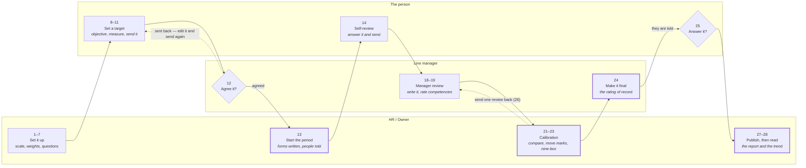
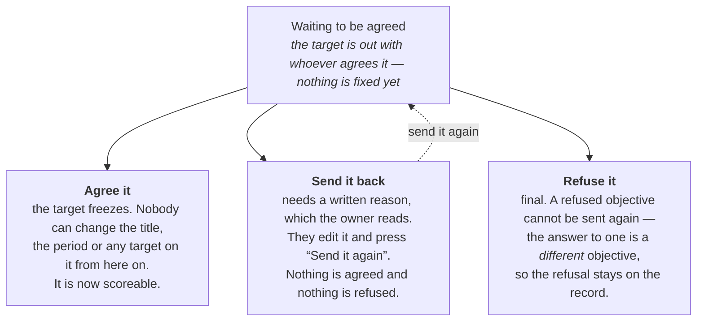
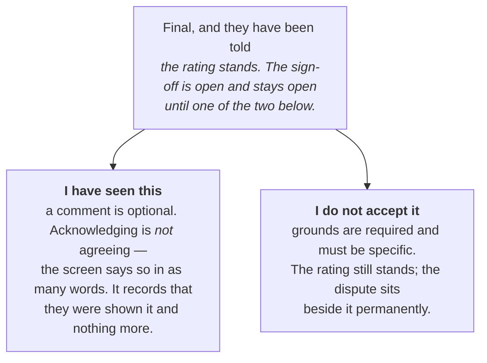

# Running an appraisal, screen by screen

Everything the Performance module does, in the order you actually do it. Follow it top to bottom
with the product open beside you and you will take a company from no appraisal at all to published
marks without guessing once. No code, no database, no jargon that is not explained the first time
it appears.

| | |
|---|---|
| **Who this is for** | Anyone walking the product — no engineering knowledge assumed |
| **How to read it** | Every step says Where, Who, Click, and what you should see |
| **How long a full walk takes** | About 40 minutes on seeded data, switching between accounts |

**Contents** — [Five words](#1-five-words-and-then-everything-else-makes-sense) ·
[The seven doors](#2-the-seven-doors-in-the-sidebar) ·
[The whole thing on one line](#3-the-whole-thing-on-one-line) ·
[The walkthrough](#4-the-walkthrough) ·
[Four seats](#5-the-same-period-from-four-seats) ·
[Eight surprises](#6-eight-things-that-will-surprise-you) ·
[What the badges mean](#7-what-the-badges-in-this-document-actually-mean) ·
[A twenty-minute demo](#8-a-twenty-minute-demo-in-order)

---

## 1. Five words, and then everything else makes sense

The module is built out of five ideas. If these are clear, no screen in it will confuse you. If any
one of them is fuzzy, several screens will.

### Appraisal period

A stretch of time you are judging people over — a half, a quarter, a probation. Starting one hands
every employee a form and tells them it is open.

> *A person's mark belongs to one period, never to "the year". Two periods can cover the same person
> and produce two different marks, and that is correct.*

### Objective — shown on screen as "KPI"

What somebody is aiming at. A target, filed against a period, owned by one person or given to a whole
department.

> *The screen is called KPIs and the buttons say KPI. Objective is the word the rest of the product
> uses for the same thing. They are not two things.*

### Measure

The number under an objective. "Offers accepted", starting at 2, aiming at 8. Progress is worked out
from it automatically.

> *An objective with no measure still works — it is then judged on a stated figure by a human rather
> than tracked.*

### Competency

How somebody works rather than what they delivered — judgement, communication, leading a team. Four
groups come ready-made. Somebody records a level against each one, once per person per period.

> *Leadership is only rated for people who actually manage somebody. For everybody else it is left
> out, not marked low. That distinction matters and the product holds it.*

### The mark

What all of it adds up to. Each part carries a percentage of the mark and the percentages total 100%
exactly.

> *There is no state where they do not total 100%, so there is never anything to reconcile
> afterwards. The product refuses a set that does not add up.*

> ### The one rule that explains half the screens
>
> An objective must be **agreed before** the period it covers, and only agreed objectives are ever
> scored. A target agreed after the result is known is not a target. This is why there is a whole
> queue screen for agreeing them, why an agreed objective freezes, and why reopening one demands a
> written reason.

---

## 2. The seven doors in the sidebar

Performance is seven separate items in the left-hand nav, not one page with tabs. Some are hidden
from some people — the right-hand column says who sees each one. If a door is missing for the
account you are signed in as, that is the product working, not a bug.

| Sidebar item | Route | What it is for | Who sees it |
|---|---|---|---|
| **Overview** | `/performance` | Your landing. What is open, what is waiting on you, what is waiting on somebody else. Start here every time. | Everyone |
| **KPIs** | `/performance/kpis` | The objective tree. Create, give out, add measures, record progress, send for agreement. | Everyone |
| **Weekly tasks** | `/performance/review-tasks` | Staff log what they did each week against an objective; managers grade it. This is the evidence a delivery score is built from. | Everyone |
| **Competency ratings** | `/performance/skills` | Record a level against a skill for one person. Also shows who is below target, and a department heatmap. | Everyone |
| **Appraisal periods** | `/performance/periods` | The list of periods. Open one to set it up, start it, move it along, and read the register of everybody in it. | HR / Owner |
| **Objectives to agree** | `/performance/approvals` | The queue. Somebody sent you a target; you agree it, send it back, or refuse it. | Line manager · HR / Owner |
| **Who appraises whom** | `/performance/appraisers` | Only appears if the company has switched multiple appraisers on. Maps who marks whom, and for what share of the mark. | HR / Owner |

Four more screens exist but have no sidebar item, because you reach them from something specific:

| Route | What it is |
|---|---|
| `/performance/reviews/{id}` | One person's appraisal |
| `/performance/periods/{id}/report` | The period's results |
| `/performance/periods/{id}/nine-box` | The calibration grid |
| `/performance/history/{employeeId}` | One person across every period |
| `/performance/how-it-works` | The product explaining itself, in its own words |

---

## 3. The whole thing on one line

Two views of the same thing. The table below is the five stages a period moves through — always
**forward**, never back. The diagram under it is the same period drawn as a relay between three
people, which is the view to hand somebody who asks "so whose job is this?".

### The five stages

| | Stage | HR / Owner is doing | The manager is doing | The person is doing |
|---|---|---|---|---|
| 1 | **Not started** | Names the period, sets the dates, writes the questions, decides who it covers | — | Sees nothing. No forms exist yet |
| 2 | **Self-review** | Watches who is outstanding, nudges the late ones | — | Fills in their own form and sends it |
| 3 | **Manager review** | — | Writes their review of each person and sends it. Records competency levels | Nothing. Self-reviews already sent are kept |
| 4 | **Calibration** | Compares marks across the company, moves any that are out of line with a written reason, places people on the nine-box | Makes each rating final. This is the point at which the person is told | — |
| 5 | **Published** | Reads the report, the distribution and the trend | — | Reads what was written about them. Acknowledges it, or formally disputes it |

The four presses that move it between stages, in order: **Start the period** → **Move to manager
review** → **Move to calibration** → **Publish the results**. All four are one-way.

### The same period, as a relay

The numbers in each box are the steps in section 4. Read it as a relay: every arrow that crosses a
lane is a hand-off, and the whole exercise is six of them. **The two dotted arrows are the only ways
anything ever goes backwards, and both need a written reason.** The four boxes with a thick border —
Start, Calibration, Make it final, Publish — cannot be undone.

> ### Two things about this that catch people out
>
> **Objectives are agreed before any of it.** The agreement loop happens ahead of the period, not
> inside it — that is why it does not appear as a stage. If you start a period with nothing agreed,
> everybody in it will finish with a mark built from competencies alone.
>
> **Moving the stage does not chase anybody.** Moving to manager review does not close self-reviews
> that are still open, and it does not stop a late one arriving. It changes what the product asks
> for next, and nothing more.

---

## 4. The walkthrough

Thirty steps in the order they have to happen. Steps marked *optional* can be skipped on a first
walk and the period will still produce marks. Every other step has something after it that will not
work if you leave it out.

> ### Why the order is what it is
>
> You create the period *first*, while it is still a draft, then file objectives against it, then
> agree them, and only then start it. That looks backwards until you remember the one rule: a target
> has to be agreed before the stretch of time it covers. The draft period is what gives the
> objectives something to be filed against.

### Phase A — once per company: decide what a mark means before you measure anybody

Three settings. You do this once and then leave it alone — a change here never moves a period that
has already started, which is deliberate.

#### 1. Check appraisals are switched on

If this is off, five of the seven sidebar items are hidden and the Overview screen says so plainly.
Nothing is deleted by switching it off, and nothing is lost by switching it back on.

| | |
|---|---|
| **Where** | `/settings/features` |
| **Who** | HR / Owner |
| **Click** | Find **Appraisals** in the modules card and make sure it is on |
| **You'll see** | Performance grows from three sidebar items to six or seven |

#### 2. Name the levels on the scale

Every form shows words, not bare numbers. The built-in five are there from the start; give them your
company's own words if you have them.

| | |
|---|---|
| **Where** | `/settings/performance` → **What a mark is called** |
| **Who** | HR / Owner |
| **Click** | Edit **What level 3 is called** and **What it means** for each of the five, then save |
| **You'll see** | The badge above the form flips from *The built-in five* to *Your company's words* |

> ⚠️ **Careful.** Two levels cannot share a word — the product refuses it, because a reader could not
> tell them apart. And a period that has already started keeps the words it started with.

#### 3. Set what the mark is made of

Five parts — objectives, core competencies, behavioural competencies, leadership, and what somebody
said about themselves. You choose the percentage each one carries.

| | |
|---|---|
| **Where** | `/settings/performance` → **The parts of a mark** |
| **Who** | HR / Owner |
| **Click** | Type a whole percentage into each **Weight** box until the running total reads 100%, then save |
| **You'll see** | Save stays dead until the total is exactly 100%, with a line telling you how much to add or take off |

> 💡 **Worth showing a stakeholder.** The self-assessment card underneath does the arithmetic out
> loud: at 20%, somebody who rates themselves 5 out of 5 rather than 3 out of 5 moves their own final
> mark by 10%. That figure moves as you drag the weight, before you save.

### Phase B — once per period: build it, and leave it as a draft

A draft period is invisible to everybody except the person building it. Nobody has a form and nobody
has been told anything. You can delete it outright right up until you start it, and after that you
never can.

#### 4. Create the period

Name it something people will recognise in their inbox — they see this and nothing else. Everything
except the name is optional and can be filled in later.

| | |
|---|---|
| **Where** | `/performance` or `/performance/periods` |
| **Who** | HR / Owner |
| **Click** | **Start an appraisal period** — top right of either screen |
| **You'll see** | A dialog with **What to call it**, the dates, **Answers due by**, and three collapsed sections |

The three collapsed sections, in the order you meet them:

- **What to tell people** — instructions shown above the first question on everybody's form, plus a
  link to your own guide if you have one. This is your only chance to frame the exercise, and most
  companies leave it blank and regret it.
- **Who it covers** — everybody, unless you tick specific departments.
- **Chase people automatically** — one reminder, some number of days before the deadline. It needs a
  due date above to count back from.

> ⚠️ **Careful.** The button reads "Start an appraisal period" but it only *creates* one. Nothing is
> sent and nobody is told. Starting it is a separate press, three steps from here.

#### 5. *Optional* — let the assistant draft it instead

Describe the period in a paragraph of your own words and it drafts the company goals and the review
questions for you to edit. Everything it writes is editable before it saves.

| | |
|---|---|
| **Where** | `/performance/periods/new` |
| **Who** | HR / Owner |
| **Click** | **Draft a period** from the Start dialog, or open the route directly |
| **You'll see** | Four steps: describe it, edit the goals, edit the questions, review and create |

> ⚠️ **If it says "No assistant is connected"** — that is expected unless somebody has set an AI key
> on the server. The screen says so and gives you two ways out; the ordinary dialog in step 4 does
> the same job by hand. Whether an assistant is wired is shown on `/settings/ai`.

> 💡 **One thing it deliberately will not do.** Every measure it suggests arrives with an **empty
> target box**. A model cannot know whether ₦40m is ambitious or already banked, and the number a
> period is judged against is not something to be guessed. You type every target yourself.

#### 6. Write the questions

A period cannot start with no questions. This is the one thing that actually blocks you.

| | |
|---|---|
| **Where** | `/performance/periods/{id}` → **Set it up, then start it** |
| **Who** | HR / Owner |
| **Click** | **Write the questions** → **Add a question** |
| **You'll see** | Each question asks three things: the wording, how they answer, and who is asked |

The three settings on a question:

- **How they answer** — in their own words, on the rating scale, or pick from a list you write.
- **Who is asked** — the person themselves, their manager, or their colleagues anonymously. A
  question can go to more than one.
- **Filed under** — which competency subsection it counts towards. A question filed under nothing is
  still asked and answered; it just counts towards no part of the mark. That is a legitimate choice,
  not a mistake, but know you are making it.

> ✅ **Shortcut.** There is a **Copy from** control that lifts every question off a previous period.
> On a second period this is the whole of this step.

#### 7. *Optional* — let managers add their own questions

A switch on the period. With it on, a line manager can add a question of their own on top of the
standard set, scoped to their own team only.

| | |
|---|---|
| **Where** | `/performance/periods/{id}` |
| **Who** | HR / Owner |
| **Click** | The toggle reading **Let managers add their own questions, scoped to their team** |
| **You'll see** | Nothing changes on this screen. It changes what a manager is offered on theirs |

### Phase C — before you start it: set the targets, and get them agreed

This is the half of the module people skip, and skipping it is what produces an appraisal nobody can
defend. An objective that was never agreed is never scored — it will simply be absent from the mark,
silently.

#### 8. Create an objective

Objectives sit in a tree. A company objective at the top, department objectives under it, one
person's objectives under those. You can start anywhere.

| | |
|---|---|
| **Where** | `/performance/kpis` |
| **Who** | Line manager · HR / Owner · anyone, for themselves |
| **Click** | **New KPI**, or **Add a KPI under this** on an existing card |
| **You'll see** | Four fields: **What is being aimed at**, **Whose KPI is this**, **Due by the end of**, **Scored in** |

> 🛑 **The field everybody misses.** **Scored in** is what files the objective against a period.
> Leave it as *Not part of an appraisal period* and the objective is a perfectly good tracker that
> **counts towards nobody's mark**. It will not warn you.

> ⚠️ **Who you can pick under "Whose KPI is this."** Your own direct reports, plus everybody in a
> department you head. Not the whole company — unless you hold the records permission, in which case
> it is everybody. If somebody you expect is missing from the list, that is why.

#### 9. Put a number on it

A measure is what makes progress track itself. Without one, somebody has to state a figure by hand
at the end.

| | |
|---|---|
| **Where** | `/performance/kpis` → open the card |
| **Who** | Line manager · the owner |
| **Click** | **Add a measure** |
| **You'll see** | **What are you counting**, **Starting at**, **Aiming at**, and a unit |

> 💡 **For things that should go down** — cost, days-to-hire, complaints. Tick **This number should
> go down** and progress becomes how far it has fallen. Without the tick, a target below the start is
> refused with an explanation rather than silently scored backwards.

#### 10. *Optional* — give the same objective to several people at once

Word it once; each person gets their own copy to track separately.

| | |
|---|---|
| **Where** | `/performance/kpis` → open a company or department card |
| **Who** | Line manager · HR / Owner |
| **Click** | **Give a KPI to people**, tick the names, confirm |
| **You'll see** | The button counts what it will do — *Assign to 4 people* |

#### 11. Send it to be agreed

Until this is pressed the objective is a private draft. It is not in anybody's queue and it cannot
be scored.

| | |
|---|---|
| **Where** | `/performance/kpis` → open the card |
| **Who** | The owner |
| **Click** | **Send to be agreed**, then **Send it** on the confirmation |
| **You'll see** | The card's agreement badge moves from *Draft* to *Waiting to be agreed* |

> 💡 **Where to watch it from.** Your own Overview then lists it under **Waiting on somebody else**,
> and it appears in your manager's **Waiting on you** at the same moment. Showing both sides of that
> is the single most convincing thing in a demo.

#### 12. Agree it — as the other person

Sign in as the manager. This is the queue screen, and it has one job.

| | |
|---|---|
| **Where** | `/performance/approvals` |
| **Who** | Line manager · HR / Owner |
| **Click** | **Agree it** on the row, then confirm |
| **You'll see** | The row leaves the queue and the objective's badge becomes *Agreed* everywhere |

There are three answers, and they end differently:

> ⚠️ **Two rules worth saying out loud in a demo**
>
> **Nobody agrees their own.** Your own objective never appears in your own queue, whatever
> permissions you hold.
>
> **Agreed means frozen.** The only way to change an agreed target is **Reopen the target**, which
> demands a reason and records who did it and when. A target that moved with no record of why is what
> makes a rating impossible to defend later.

### Phase D — the period runs: start it, and collect the forms

Starting is the point of no return. It writes a form for every employee who is not archived or
exited, tells them in the app, and the period can never be deleted again.

#### 13. Start the period

| | |
|---|---|
| **Where** | `/performance/periods/{id}` |
| **Who** | HR / Owner |
| **Click** | **Start the period**, then confirm |
| **You'll see** | A message counting exactly what happened — *"12 forms written · 12 told in the app"* |

> 🛑 **Read the two warnings it gives you.** Starting a period returns two lists **by name**, and
> they are the only time anybody is told:
>
> **Nobody is appraising them** — these people will finish the period with no mark at all. Fix it on
> `/performance/appraisers` or by setting their manager on their record.
>
> **Nothing agreed to be judged on** — these people have no agreed objective, so the objectives part
> of their mark is empty and the rest is reweighted around it.

> ⚠️ **Nothing here sends email.** People are told inside the app only. If your walkthrough audience
> expects an email to arrive, say so before you press it.

#### 14. Fill in a self-review — as an ordinary employee

Sign in as somebody with no special permissions. This is what 90% of the company will ever see of
the module, so it is worth walking properly.

| | |
|---|---|
| **Where** | `/performance` → **Waiting on you** |
| **Who** | The person |
| **Click** | **Fill it in** on the row, answer the questions, then **Send it** |
| **You'll see** | The row leaves *Waiting on you*, and a *Sent* badge appears on the form |

- **Save and finish later** keeps a half-typed answer without sending it. Nobody else can see a form
  that has not been sent.
- **Overall mark** is optional. Leaving it blank is a real choice — it means the answers say enough —
  and it is not read as a zero anywhere.
- Questions marked as required must be answered before Send will work. The screen counts what is
  still missing.

#### 15. *Optional* — log what you did each week

A separate, ongoing loop that runs all year rather than at appraisal time. Staff log a line of what
they did against an objective; their manager grades it. It is the evidence behind a delivery score.

| | |
|---|---|
| **Where** | `/performance/review-tasks` |
| **Who** | The person logs · line manager grades |
| **Click** | Pick an objective, write what you did, log it. The manager sees it under *Waiting on a grade* |
| **You'll see** | Rows grouped by the day each task was *logged* — not the week it covers |

#### 16. Chase the people who have not sent theirs

| | |
|---|---|
| **Where** | `/performance/periods/{id}` → **Still to come in** |
| **Who** | HR / Owner |
| **Click** | **Nudge who is late** |
| **You'll see** | A count of who was nudged — and, separately, how many could not be reached because they have no sign-in |

> ✅ **The honest number.** Somebody with no login cannot be nudged in the app, and the product says
> so as its own line rather than quietly counting them as reached. It is a small thing that a careful
> PM will notice and like.

#### 17. Move it to manager review

| | |
|---|---|
| **Where** | `/performance/periods/{id}` |
| **Who** | HR / Owner |
| **Click** | **Move to manager review** |
| **You'll see** | *"Managers write their reviews now. Self-reviews already in are kept."* |

> 🛑 **One-way.** There is no button that moves a stage backwards, in this screen or anywhere else.

#### 18. Write a review of somebody — as their manager

| | |
|---|---|
| **Where** | `/performance` → **Waiting on you** |
| **Who** | Line manager |
| **Click** | **Fill it in**, answer, set an **Overall mark**, then **Send it** |
| **You'll see** | Their self-review is readable beside your own form, under *What they said about their own period* |

> 💡 **The language check — worth demonstrating.** Press Send and the product reads what you wrote
> first. It flags language describing a *person* rather than their *work*, absolutes, comparisons to
> a colleague, and anything touching a protected characteristic — quoting your exact phrase back at
> you. It never blocks: the button becomes **Send anyway** on the second press.
>
> Type *"Chidera is quite disorganised"* into a manager review and watch it catch. Then type *"the
> Lagos migration was difficult"* and watch it correctly say nothing. This runs entirely inside the
> product — no written appraisal comment is sent anywhere.

#### 19. Record competency levels

Separate from the review form, and easy to forget. A person with no competency ratings gets a mark
built from their objectives alone.

| | |
|---|---|
| **Where** | `/performance/skills` |
| **Who** | Line manager · HR / Owner |
| **Click** | **Record a level** → who, which skill, where they are now, where they should be |
| **You'll see** | The *Below target* count and the department heatmap both move as you record |

> 🛑 **The same trap as step 8.** **Scored in** is on this dialog too. Leave it blank and the level is
> recorded but counts towards no period's mark.

#### 20. *Optional* — ask colleagues for feedback

| | |
|---|---|
| **Where** | `/performance/periods/{id}` → the *Feedback* column on a person's row |
| **Who** | HR / Owner |
| **Click** | Search names, tick who to ask, send. Each of them gets a form waiting in the app |
| **You'll see** | Answers appear on the person's own Overview under *Peer feedback*, with no name attached |

### Phase E — calibration: compare across the company, then make the marks final

Calibration is the stage where a company looks at every mark side by side and asks whether two
managers have been using the same scale. It is also where a rating stops being a draft and becomes
the thing a person is told.

#### 21. Move it to calibration

| | |
|---|---|
| **Where** | `/performance/periods/{id}` |
| **Who** | HR / Owner |
| **Click** | **Move to calibration** |
| **You'll see** | *"Marks are in. Nothing else is asked for until you publish."* A *Calibration* column appears on the register |

> 💡 **This is what unlocks finalising.** Ratings to be made final only appear in a manager's
> **Waiting on you** once the period is at calibration. If a manager tells you they cannot see
> anything to finalise, this is almost always the reason.

#### 22. Move a mark that is out of line

One manager marks generously and another marks hard. Calibration is where that is corrected, on the
record rather than in a corridor.

| | |
|---|---|
| **Where** | `/performance/periods/{id}` → **Where the marks stand** |
| **Who** | HR / Owner |
| **Click** | **Move the mark** on the row → new percentage → **Why** |
| **You'll see** | The row shows both figures: what the answers produced, and what it was moved to |

> ⚠️ **The reason is not optional and not a formality.** It is kept with the mark and it is what
> explains the change if anybody asks years later. A few words is refused; the product asks for a
> sentence.

#### 23. *Optional* — place people on the nine-box

Performance against potential, on a three-by-three grid. Performance comes from the period; potential
is a judgement somebody records here.

| | |
|---|---|
| **Where** | `/performance/periods/{id}/nine-box` |
| **Who** | HR / Owner |
| **Click** | **Place them** on somebody in the *Not on the grid* list → how far could they go → **Why** |
| **You'll see** | They move onto the grid, and the *Not placed* count falls |

> ✅ **Worth pointing out to a stakeholder.** Anybody missing either half is **named underneath the
> grid** with which half is missing, rather than being dropped into the bottom-left box. As the screen
> puts it: an absence is not the bottom of a scale. Most nine-box tools get this wrong.

#### 24. Make a rating final

The most consequential button in the module. It turns a written review into the rating of record and
tells the person.

| | |
|---|---|
| **Where** | `/performance/reviews/{id}` — reached from **Waiting on you** |
| **Who** | Line manager · HR / Owner |
| **Click** | **Make this the rating**, then confirm |
| **You'll see** | A *Final* badge, and the row moves to **Waiting on somebody else** — it is their move now |

> 🛑 **It cannot be re-marked afterwards.** The confirmation says so. Once final, the mark cannot be
> changed, and the person has been told. If a review genuinely needs redoing after this, the only
> route is step 26.

### Phase F — the person answers: sign-off, and the two ways it can go

A final rating is not finished until the person it is about has answered it. Leaving it unanswered is
deliberately not one of the options.

#### 25. Acknowledge, or formally dispute

| | |
|---|---|
| **Where** | `/performance/reviews/{id}` — reached from **Waiting on you** |
| **Who** | The person |
| **Click** | **I have seen this** or **I do not accept it** |
| **You'll see** | A banner reading *"This rating is final. It needs your answer."* above both buttons |

> ⚠️ **One answer only.** The dialog says it before you press: you can do this once, and it cannot be
> swapped for the other afterwards. Three separate states exist and the product never confuses them —
> acknowledged, disputed, and *nobody has asked them yet*, which is the common one.

#### 26. *Optional* — send one review back to be redone

The escape hatch. It reopens exactly one review so one person can have another pass at it. Nobody
else's review moves.

| | |
|---|---|
| **Where** | `/performance/periods/{id}` → the *Revision* column |
| **Who** | HR / Owner |
| **Click** | **Send back** → choose **Manager review** or **Self-appraisal** → **Why** |
| **You'll see** | The row reads *Sent back, awaiting resubmission*, and the reason is shown to the person |

> 💡 **It asks which review rather than guessing.** Self-appraisal and manager review are two
> different documents by two different people. Reopening the wrong one would send the wrong person
> back to work.

### Phase G — close it out: publish, then read what the period actually said

#### 27. Publish the results

| | |
|---|---|
| **Where** | `/performance/periods/{id}` |
| **Who** | HR / Owner |
| **Click** | **Publish the results**, then confirm |
| **You'll see** | Either *"Every manager's review is now readable by the person it is about"*, or a count of how many people finish with no mark — **by name** |

> ⚠️ **Read the names it gives you.** If anybody finishes with no mark, publishing is the last moment
> anybody is told. Those people go through a whole appraisal period and come out the other side with
> nothing.

#### 28. Read the period report

| | |
|---|---|
| **Where** | `/performance/periods/{id}/report` |
| **Who** | HR / Owner |
| **Click** | **See the report** from the period screen |
| **You'll see** | Headcount, how many have a mark, the average, the distribution across the five bands, and a table by department |

> ✅ **The thing to check, and the thing to say.** **Two headcounts, never divided into each other.**
> "People in this period" and "with a mark" are separate figures in separate cards, each stating its
> own total. The average is over the marks that exist and reads as blank when there are none — never
> 0%.
>
> Three lists name people rather than counting them: *nobody marked them*, *written but not
> finalised*, and *told, and no answer yet*. Those are the three things that stop a period from being
> finished.

#### 29. Read one person across every period

| | |
|---|---|
| **Where** | `/performance/history/{employeeId}` |
| **Who** | HR / Owner · their manager · themselves |
| **Click** | Reached from a person's record and from the appraisal screen |
| **You'll see** | Every mark in order, with the change against the previous one, and what was said each time |

> 💡 **Two details worth demonstrating.** A period where nothing was recorded is **skipped, not
> plotted as zero** — the change is measured against the last period that actually has a mark, and the
> empty ones are named underneath. A fall and a recovery that never happened is the easiest chart in
> the world to draw by accident.
>
> The person themselves sees only finalised marks, and is told how many are withheld. A working
> figure moves every time somebody records a rating, so they see it when it is final and not before.

#### 30. Start the next one

Back to step 4. On a second period, step 6 collapses to one press of **Copy from**, and phases A and
B are already done.

| | |
|---|---|
| **Where** | `/performance/periods` |
| **Who** | HR / Owner |
| **Click** | **Start an appraisal period** |
| **You'll see** | The previous period stays exactly as it was. Marks belong to a period, not to a person's year |

---

## 5. The same period, from four seats

Nobody does all thirty steps. Here is the whole of each person's job, so you can hand somebody one
card and nothing else.

### The person — every employee

Sees three sidebar items. Never sees a period, a register or a report.

1. Set your own objectives on **KPIs** and press **Send to be agreed**.
2. Log what you did each week on **Weekly tasks**, if your company uses it.
3. When a period starts, fill in your self-review from **Overview** and send it.
4. When your rating is final, answer it: **I have seen this** or **I do not accept it**.

> **Everything you owe is on Overview.** If that screen says *Nothing needs you*, you are up to date.
> There is nowhere else to check.

### Line manager — anyone with reports

Everything above, plus four things about other people. Not a role you are given — it follows from
who reports to you.

1. Agree your reports' objectives on **Objectives to agree**, or send them back with a reason.
2. Set objectives *for* your reports on **KPIs**.
3. Write a review of each report when the period reaches manager review, and record their competency
   levels.
4. At calibration, press **Make this the rating** on each one.

> ⚠️ **Being a department head widens this** to everybody in your department, not only your direct
> reports. Being given the "Department Manager" role does not — that role is about leave and equipment
> and grants nothing here.

### HR / Owner — runs the exercise

Sees all seven items. Holds the settings and the company-wide reads.

1. Once: the scale, the weights, and the feature switch.
2. Per period: create it, write the questions, decide who it covers, start it.
3. While it runs: watch who is outstanding, nudge, move the stage along.
4. At calibration: move any mark that is out of line, place people on the nine-box.
5. At the end: publish, then read the report.

> 🛑 **Four presses are one-way** and every one of them is yours: start, each stage move, and publish.
> Nothing takes a period backwards.

### A colleague — asked for feedback

Not a role at all — anybody can be asked, once, about one person.

1. A form appears under **Waiting on you** on your Overview.
2. Answer it and send it. That is the whole of it.
3. Your answers reach the person with **no name attached**.

> The screen states the anonymity once, at the top, and claims exactly what is true: no name is
> attached to an answer, for anybody, including HR.

---

## 6. Eight things that will surprise you

Every one of these is deliberate. If you are demonstrating the product, several are worth pointing at
on purpose — they are the arguments the module is built on.

| What you will notice | Why it is like that |
|---|---|
| **Nothing sends email.** | People are told inside the app only — starting a period, being nudged, being told a rating is final. Every message that mentions it says so rather than leaving you to find out. |
| **An empty figure is blank, never 0%.** | Nobody scored yet reads *No mark*. A competency nobody rated reads *Nothing recorded*. A zero would be a claim that somebody performed at nothing, which is a completely different fact from nobody having looked. |
| **Leadership is missing for most people.** | It is only rated for people who actually manage somebody. For everybody else it is left out of the mark and the rest is reweighted, rather than being scored low. |
| **You cannot agree your own objective.** | Whatever permissions you hold, your own never appears in your own queue. Same rule as payroll: the person who proposes something is not the person who signs it off. |
| **An agreed objective cannot be edited.** | Not the title, not the period, not any target, and no new measure — because adding one changes what delivering it means. **Reopen the target** is the only way through and it records who, when and why. |
| **A refusal is final.** | A refused objective cannot be resubmitted. The answer to a refused objective is a *different* objective, so the refusal stays on the record instead of being written over. |
| **Changing the weights does not move a running period.** | A period keeps the weights and the scale words it started with. Otherwise a mark somebody was told in March would quietly become a different mark in June. |
| **"Finalise" only appears at calibration.** | A manager at the manager-review stage has nothing to finalise and correctly sees no such button. Move the period to calibration and the rows appear. |

---

## 7. What the badges in this document actually mean

Four labels have been used throughout. Here is exactly what each one is, in case you need to set an
account up or ask an engineer why somebody cannot see something.

| Badge | What it really is | Who has it out of the box |
|---|---|---|
| **Everyone** | Any account that can sign in. No permission required. | Everybody, including the Employee role, which holds nothing. |
| **The person** | The subject of the form. Resolved from who they are, not from a permission. | Whoever the review or objective is about. |
| **Line manager** | **Having direct reports.** Not a role — it follows from the reporting line on people's records. Widened to a whole department for whoever is set as that department's head. | Nobody, until somebody's record names them as a manager. |
| **HR / Owner** | Two separate permissions that happen to travel together: *Manage settings* (start a period, weights, scale) and *Edit records* (read every mark in the company). | The **Owner** and **HR manager** roles. Notably **not** Department Manager, Branch Manager or Payroll officer. |

> ⚠️ **The one that trips people up in testing.** The role called **Department Manager** grants
> nothing in Performance. It is about approving that department's leave and seeing its equipment. What
> gives somebody authority over appraisals is being *set as the head of a department* on the
> Departments screen, or having people report to them — two different facts, in two different places,
> neither of them the role's name.

---

## 8. A twenty-minute demo, in order

If you have one sitting and an audience, this is the sequence. It skips everything optional and shows
both sides of every hand-off, which is the part that convinces people. You will need three accounts
open — an ordinary employee, their manager, and an HR or Owner account. The sign-in screen lists the
seeded accounts to use.

| # | Do this | What to point at |
|---|---|---|
| 1 | **HR** — `/settings/performance`. Show the five weights totalling 100%, then drag one so it does not. | Save goes dead and the product tells you how much to add. A mark that cannot fail to add up. |
| 2 | **HR** — **Start an appraisal period**. Name it, set a due date, open *What to tell people*, type two sentences. Create it. | Nobody has been told anything yet. Say so. |
| 3 | **HR** — **Write the questions**. Add one for the person and one for their manager. | *Filed under*. And Start is dead until at least one question exists, and says why. |
| 4 | **Employee** — `/performance/kpis`. **New KPI**, set *Scored in* to the new period, add a measure, **Send to be agreed**. | Their Overview now shows it under *Waiting on somebody else*. |
| 5 | **Manager** — `/performance`. The same objective is in **Waiting on you**. Open the queue and agree it. | Both sides of one action, thirty seconds apart. **This is the moment the demo lands.** |
| 6 | **Manager** — go back to KPIs and try to change the target you just agreed. | The controls are gone and a sentence above says why. Not a refusal after the click — the offer was never made. |
| 7 | **HR** — **Start the period**. Confirm, then read the result out loud. | How many forms, how many told, and any names it gives you. "Nobody is appraising them" if it appears. |
| 8 | **Employee** — **Fill it in**. Answer, leave the overall mark blank on purpose, send it. | Blank is a choice, and nothing downstream reads it as zero. |
| 9 | **HR** — **Move to manager review**. | Self-reviews already in are kept. Say it; people assume otherwise. |
| 10 | **Manager** — write the review. Type *"Chidera is quite disorganised"* and press Send. | It quotes the phrase back at you and the button becomes **Send anyway**. It never blocks — and nothing you typed left the product. |
| 11 | **HR** — **Move to calibration**, then **Move the mark** on one person with a reason. | The row keeps both figures: what the answers produced, and what it was moved to. |
| 12 | **Manager** — **Make this the rating**. Read the confirmation aloud before pressing it. | This is the one-way door and the moment the person is told. |
| 13 | **Employee** — answer it. **I have seen this**. | The sentence saying acknowledging is not agreeing. Then show the other button is now gone. One answer, once. |
| 14 | **HR** — **See the report**. Finish here. | The two headcounts, and the three lists of names: nobody marked them, written but not finalised, told and no answer yet. |

---

*Written against the product as it stands on 11 September 2026. Every button label, field name and
message quoted here is the wording actually on screen — where the product says something in its own
words, this document quotes it rather than paraphrasing, so the two cannot drift apart. If a label
here does not match what you are looking at, trust the screen and flag the difference.*
